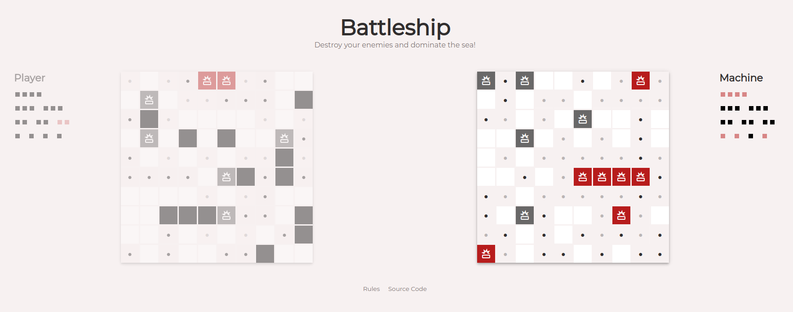

# Battleship



This application implements the popular game known as Battleship and it is the submission for [The Odin Project: Battleship](https://www.theodinproject.com/lessons/node-path-javascript-battleship). 

The key features are:

- Fast Paced Variation 
- Fully Tested
- Cross-Platform Compatibility


## Live Demo

[Battleship](https://jesusgraterol.github.io/battleship-top/)


## Getting Started

### Requirements

- GIT
- NodeJS ^v21.0.0
- NPM ^v10.2.0

### Installation

1) Clone the repository
```bash
git clone git@github.com:jesusgraterol/battleship-top.git
```

2) Install the dependencies
```bash
npm install
```


## Usage

1) Run the Webpack Build in `watch` mode

```bash
npm run serve
```

2) Open the `./dist/index.html` file with your favorite browser.


## Build Process

1) Run the Webpack Build
```bash
npm run build
```


## Deployment

1) Push the new build to the `gh-pages` branch so it is deployed to **Github Pages**:

```bash
git subtree push --prefix dist origin gh-pages
```


## Built With

- HTML5
- CSS3
- JavaScript
- Jest
- Webpack


## Running the Tests

```bash
# Unit Tests
npm run test:unit

# Integration Tests
npm run test:integration

# E2E Tests
N/A
```


## @TODO

Machine Upgrades:
- When a player's ship is hit, keep hiting the surounding tiles until it is sunk.
- Identify the best tiles to attack based on the player's remaining ships


## License

[MIT](https://choosealicense.com/licenses/mit/)


## Acknowledgments

- [Google Fonts](https://fonts.google.com/icons)
- [ESLint](https://eslint.org/)
- [Jest](https://jestjs.io/)
- [Babel](https://babeljs.io/)
- [Webpack](https://webpack.js.org/)
- [uuidjs](https://github.com/uuidjs/uuid)